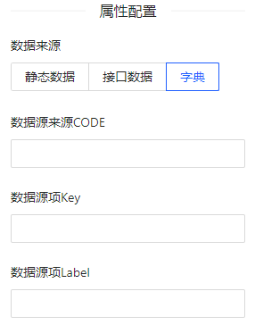

#  doFcDesigner
vue3  ant版本 表单设计器 基于 [form-create](http://form-create.com/) 的 [form-create-designer](http://designer.form-create.com/guide/)官方升级而成 

## npm
```
npm i andvx
```

## 扩充

1. 表单组件
    - 隐藏域

2. 辅助组件
    - 进度条

3.  布局组件
    - 数组
    - 表格
    - 卡片
    - 标签页

*使用【数组、表格组件、自定义字典、隐藏域替换type属性配置】时需引入 initRules 解析
## 使用

组件方法依然支持官方，[可点击查看](http://designer.form-create.com/guide/api.html#getrule)

必须全局注册 formCreate

main.js
```
import { createApp } from 'vue'
import formCreate from "@form-create/ant-design-vue";
const app = createApp(App)

app.component(formCreate.name, formCreate);

```

xxx.vue
```
<template>
    <div style="height: 80vh;">
    <DoFCDesigner ref="fcDesignerRef">
        <template #btns>
            <a-space>
                <a-button type="primary" @click="viewer" >预览</a-button>
                <a-button >清空</a-button>
            </a-space>
        </template>
    </DoFCDesigner>
    </div>
</template>

<script>
import { defineComponent, ref } from "vue";
import DoFCDesigner from "andvx/components/doFCDesigner";
import { initRules } from "andvx/components/doFCDesigner/utils/parse";

export default defineComponent({
    components: { DoFCDesigner },
    setup(){
        //字典格式
        const fcDesignerRef = ref()
            dictionary = ref({
            'XYG': [
                { name: 'XYG1', code: '1' },
                { name: 'XYG2', code: '2' },
                { name: 'XYG3', code: '3' },
            ]
        })

        const viewer = () => {            
            const rule = fcDesignerRef.getRule();
            initRules(rule, dictionary.value);
            console.log(rule)
        }

        return {
            fcDesignerRef,
        }
    }
})
</script>
```


## 字典格式说明


```
dictionary = {
    key:[
        {name,code},
        ......
    ]

}
```
图上填值与实际数据格式对应表

|  图值  | 格式  |
| ----  | ---- |
| code  | key   |
| key   | code  |
| label | name  |

## demo 

[在这里](../../src/views/form/fcDesigner.vue)